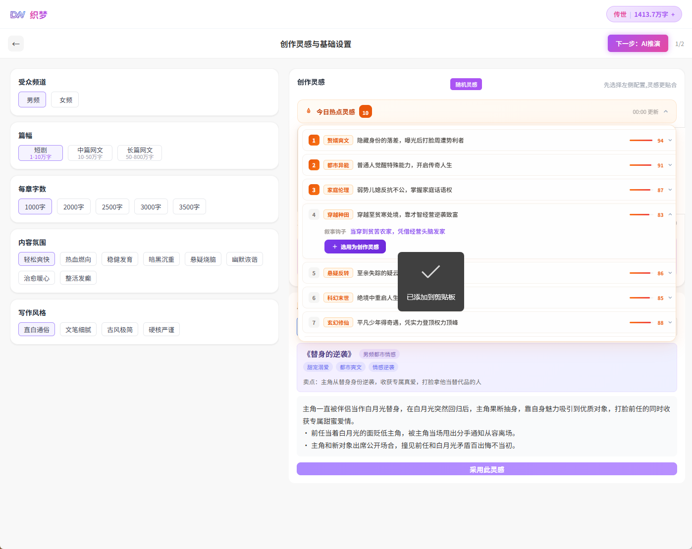
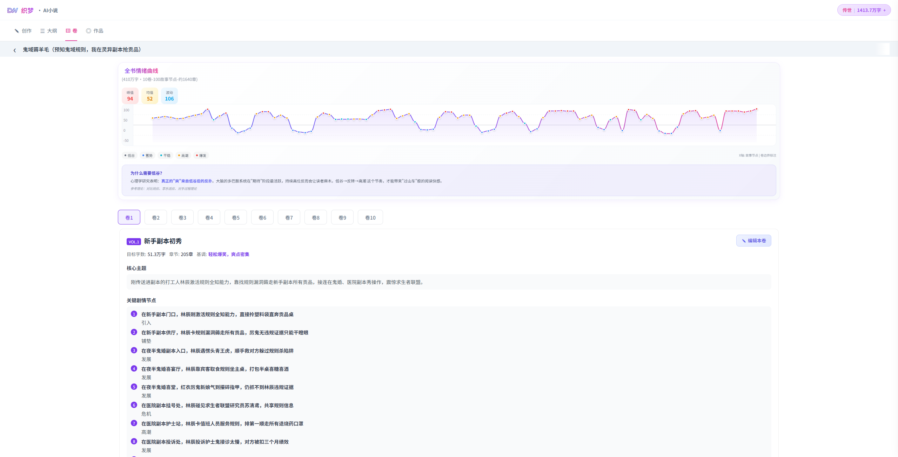
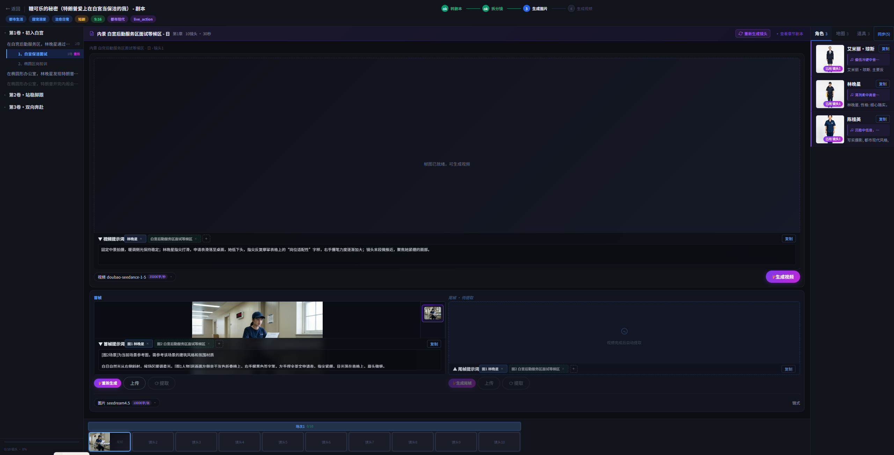
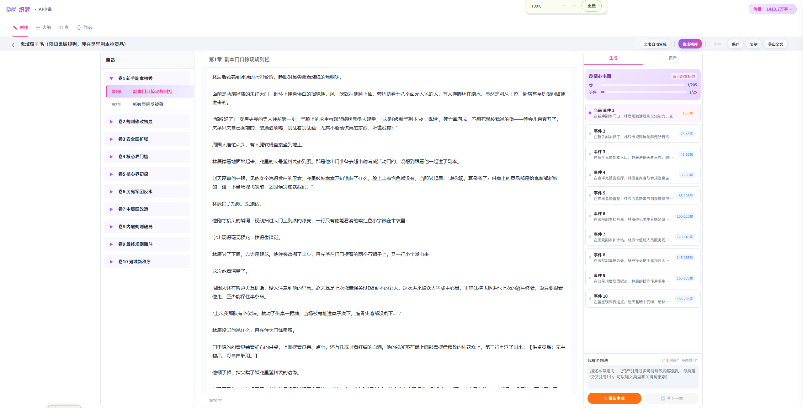

一个面向 AI 编程代理的工业级 Skill Pack。

它的目标不是让 AI 输出更多流程话术，而是让 AI 在真实工程项目里做到：少打扰、高自治、强闭环、可验证、可部署、可复盘。

## 解决什么问题

AI 编程代理常见的问题往往不是“不会写代码”，而是：

- 不读项目结构，直接全局乱搜。
- 没弄清需求边界就开始改。
- 盲猜 API、字段、路径、环境变量。
- 修 bug 时原样重复失败命令。
- 前端只做正常态，漏掉 loading / error / empty。
- 改了后端、数据库、环境变量，却忘记记录部署动作。
- 线上部署时漏构建、漏迁移、漏同步 `.env`。
- 提示词泄露，或者 AI 输出结构不稳定。
- 代码越写越散，重复 store、重复 service、重复弹窗。
- 根目录堆满临时文件、导出文件、日志、数据库和构建产物。
- 给远程团队交付时漏掉模型配置、dev 环境或敏感配置分层。

这个 Skill Pack 把这些高频失误沉淀成一组可复用的工程规则。

## 项目案例

Skill Pack 的规则来自真实 AI 工程项目中的长期实践，主要包括：

- [织梦 AI](https://moliaiic.xyz/)：[织梦 AI](https://moliaiic.xyz/)是一个AI故事剧本与视频创作平台，织梦AI有非常复杂的算法和工作流，全部都是用这个skill+AI做的，很少返工
- 简单介绍下项目  
 1、结合互联网热点生成故事种子，然后经过大纲和卷就可以写作了，然后写作一章就可以直接转剧本和视频，方便大家做短剧的可以低成本的快速试错；  
    
 2、内置了情绪算法、自主行为引擎、大世界自演化引擎等可以让故事活过来，区别于现在市场上写故事的，干巴巴的围绕主角叙事，没有情绪，都是工具人；  
     
 3、系统有专业的剧本、镜头拆分算法， 视频模块会自动拼接和调用资产，比如角色设定图、声纹这些，不用写提示词也不用自己组装  
    
 4、可以在队列上实现多个故事剧本并行写作，实现真正的高产。    
         
- 底层结构上覆盖提示词治理、移动端 UI、CICD、统一提示词路由、统一扣费服务、多层记忆自动处理机制、资产处理引擎等。

- 后续更新、AI具体的实践案例和 AI 编程工作流，也可以关注我公众号：


## 适用对象

适合这些场景：

- 使用 Codex / AI Agent 做日常开发。
- 需要 AI 自动维护项目结构地图。
- 需要 AI 自动维护部署账本。
- 项目包含前端、后端、数据库、部署、AI 调用、提示词或模型配置。
- 团队希望 AI 少问废话，但在高风险操作前能停下来确认。
- 希望把 AI 的“经验教训”沉淀为长期规则，而不是每次重新提醒。

不适合这些场景：

- 只想让 AI 生成单个代码片段。
- 不希望 AI 读取或维护项目文件。
- 不需要部署、测试、工程地图或团队协作规范。

## 核心设计

本项目采用“路由器 + 专项技能”的结构。

- `AGENTS.md` 是总路由器，负责识别任务意图、项目根目录、高风险操作和结束汇报。
- 每个 `*/SKILL.md` 是一个专项技能，只在对应场景激活。
- `TOPOLOGY.md` 是本 Skill Pack 自己的工程地图，用于说明当前目录结构和职责边界。

这种结构避免把所有规则塞进一个巨大的 System Prompt，也避免 AI 每次任务都加载不相关的约束。


## 目录结构

```text
.
├── AGENTS.md
├── README.md
├── TOPOLOGY.md
├── topology-maintainer/
│   └── SKILL.md
├── deploy-ledger/
│   └── SKILL.md
├── safety-gate/
│   └── SKILL.md
├── debug-investigator/
│   └── SKILL.md
├── ui-guardian/
│   └── SKILL.md
├── requirements-architect/
│   └── SKILL.md
├── prompt-governor/
│   └── SKILL.md
├── repo-hygiene-auditor/
│   └── SKILL.md
├── verification-runner/
│   └── SKILL.md
├── handoff-packager/
│   └── SKILL.md
└── code-quality-sentinel/
    └── SKILL.md
```

## Skill 一览

| Skill | 职责  |
| --- | --- |
| `AGENTS.md` | 总路由器：意图识别、项目根目录识别、高风险确认、结束汇报 |
| `topology-maintainer` | 维护项目 `TOPOLOGY.md` 工程地图 |
| `deploy-ledger` | 维护项目 `DEPLOY_MANIFEST.md` 部署账本 |
| `safety-gate` | 控制生产部署、数据库、真实密钥、大量删除、Git 推送等高风险操作 |
| `debug-investigator` | 报错排查、日志证据链、根因修复、Known Pitfalls 沉淀 |
| `ui-guardian` | UI/UX、移动端/iOS、弹窗层级、图标、loading/error/empty 状态闭环 |
| `requirements-architect` | 需求澄清、技术规格锁定、架构一致性 |
| `prompt-governor` | 提示词、AI 调用、JSON 解析、扣费、余额、提示词泄露防护 |
| `repo-hygiene-auditor` | 仓库清理、废弃文件、孤立模块、依赖检查 |
| `verification-runner` | 测试、构建、smoke、E2E、部署检查策略 |
| `handoff-packager` | 提示词、配置、dev 环境、敏感交付包分层 |
| `code-quality-sentinel` | 巨石文件、重复逻辑、命名、职责拆分、幽灵依赖防御 |

## 工作方式

### 1. 先识别项目根目录

当任务涉及项目文件时，AI 会向上查找：

```text
TOPOLOGY.md
DEPLOY_MANIFEST.md
package.json
pnpm-workspace.yaml
pyproject.toml
Cargo.toml
go.mod
.git
```

`TOPOLOGY.md` 和 `DEPLOY_MANIFEST.md` 是项目级文件，不能跨项目混用。

### 2. 再按任务激活 skill

例如：

- 用户说“这个功能在哪”：激活 `topology-maintainer`。
- 用户说“页面样式不一致”：激活 `ui-guardian`。
- 用户给出报错日志：激活 `debug-investigator`。
- 用户要部署或改数据库：激活 `deploy-ledger` 和 `safety-gate`。
- 用户要优化提示词或 JSON 解析：激活 `prompt-governor`。
- 用户要清理根目录：激活 `repo-hygiene-auditor`。
- 用户要打包给远程团队：激活 `handoff-packager`。

### 3. 默认自动推进

本 Skill Pack 的原则是低打扰。

AI 不会因为普通实现细节频繁询问用户。它会优先从代码、配置、日志、工程地图和部署账本中寻找事实。

只有这些情况需要确认：

- 需求存在互斥解释。
- 技术选型会改变长期架构。
- 数据库 schema 或生产数据会受影响。
- 涉及真实费用、扣费、会员、权限。
- 涉及真实密钥或生产环境。
- 大量删除、清空目录、强制推送、生产部署等不可逆操作。

### 4. 结束时给出短汇报

每次任务结束时，AI 应简短说明：

```text
TOPOLOGY.md：已更新 / 无结构变化
DEPLOY_MANIFEST.md：已更新 / 已归档清空 / 无需记录
验证：已执行什么 / 未执行原因
风险：是否有待确认项
```

## 关键文件

### `TOPOLOGY.md`

项目工程地图。

用于记录：

- 技术栈。
- 目录结构。
- 模块索引。
- API 索引。
- 状态管理。
- 配置入口。
- 部署入口。
- Known Pitfalls。
- Search Hints。

它的目标是让 AI 下次更快定位，不是写流水账。

### `DEPLOY_MANIFEST.md`

项目部署账本。

用于记录：

- 待部署事项。
- 环境变量变更。
- 数据库迁移。
- 后端变更。
- 前端构建要求。
- 脚本和基础设施变更。
- 部署归档。
- 部署踩坑。

它的目标是防止漏部署、漏迁移、漏同步配置。

### `TECH_SPEC.md`

项目级技术规格文档。

不是每个项目都强制创建，但在这些场景建议创建或更新：

- 新项目初始化。
- 技术栈首次明确。
- 切换框架、数据库、服务器、部署方式。
- 新增关键外部服务：支付、AI provider、对象存储、消息队列。
- 团队协作需要统一开发和部署规格。

推荐内容：

```md
# TECH_SPEC.md

## Runtime
- Frontend:
- Backend:
- Package Manager:
- Python/Node Version:

## Frameworks
- Web:
- API:
- ORM:
- UI:

## Data
- Database:
- Migration:
- Cache:
- Storage:

## Services
- API Server:
- Admin:
- H5/Web:
- Worker/Scheduler:

## Build & Run
- Local:
- Test:
- Production:

## Environment Variables
- VARIABLE_NAME: purpose, no secret value

## Verification
- Build:
- Test:
- Smoke:
- Deploy Check:
```

## 安装与使用

### 方式一：作为项目级规则使用

将本仓库内容放到你的项目规则目录，确保 AI 能读取：

```text
AGENTS.md
*/SKILL.md
```

然后在项目根目录维护：

```text
TOPOLOGY.md
DEPLOY_MANIFEST.md
TECH_SPEC.md
```

### 方式二：作为 Codex Skill Pack 维护

保留当前目录结构：

```text
SKill/
├── AGENTS.md
├── topology-maintainer/SKILL.md
├── deploy-ledger/SKILL.md
└── ...
```

当你需要在另一个项目使用时，将 `AGENTS.md` 和所需 skill 复制或软链接到目标环境。

## 使用示例

### 定位功能

用户：

```text
找一下视频生成按钮在哪个文件
```

AI 行为：

- 读取目标项目 `TOPOLOGY.md`。
- 根据地图定位视频模块。
- 地图缺失时再搜索项目文件。
- 返回文件路径和调用链。

### 修复 Bug

用户：

```text
页面点击报错 navigateTo:fail can not navigateTo a tabbar page
```

AI 行为：

- 激活 `debug-investigator`。
- 查找页面跳转链路。
- 判断 UniApp tabBar 页面应使用 `switchTab`。
- 修复代码。
- 验证构建或关键页面行为。
- 将坑点写入 `TOPOLOGY.md -> Known Pitfalls`。

### 优化提示词

用户：

```text
灵感扩展泄露了提示词，不要告诉用户如何写，要输出故事简介本身
```

AI 行为：

- 激活 `prompt-governor`。
- 区分灵感扩展与梗概职责。
- 检查 prompt source、JSON 解析、输出 schema。
- 修改提示词。
- 若需要同步数据库 prompt template，更新 `DEPLOY_MANIFEST.md`。

### 交付远程团队

用户：

```text
把提示词、dev 配置和大模型数据打包给远程团队
```

AI 行为：

- 激活 `handoff-packager`。
- 生成 `public/` 和 `sensitive/` 两层目录。
- 不在聊天中打印真实密钥。
- 输出 zip 路径、内容摘要和风险说明。

## 安全边界

本项目强调低打扰，但不是无约束自动执行。

以下操作必须确认：

- 生产部署。
- 数据库迁移或生产数据写入。
- 大量删除、清空目录、覆盖重要配置。
- `git push`、force push、reset hard、clean。
- 修改真实密钥、权限策略、认证逻辑。

确认前必须说明：

```text
操作：
影响范围：
涉及环境：
风险：
回滚建议：
```

## 开源建议

推荐使用 **Apache License 2.0**。

原因：

- 适合工具、框架、规则包、工程规范类项目。
- 商业友好。
- 比 MIT 多一层明确的专利授权。
- 适合未来被公司、团队、插件生态复用。

如果你只追求极简传播，也可以使用 MIT；如果希望衍生版本必须开源，可以考虑 GPLv3，但传播阻力会更高。

## 贡献规范

欢迎提交新的 skill 或改进现有 skill。

建议每个 skill 遵循同一结构：

1. 目标：解决什么风险。
2. 触发条件：什么时候必须使用。
3. 不触发条件：避免过度激活。
4. 核心原则：少量高价值约束。
5. 工作流：执行顺序，保持可执行、可验证。
6. 检查清单：最终自检。
7. 联动规则：是否更新 `TOPOLOGY.md` / `DEPLOY_MANIFEST.md` / `safety-gate`。
8. 结束汇报：短格式。

提交前请检查：

- 是否引入重复规则。
- 是否会让 AI 频繁无意义询问。
- 是否包含真实密钥、账号、服务器敏感信息。
- 是否把一次性项目细节写成通用规则。
- 是否让规则变成冗长流程，而不是可执行约束。


